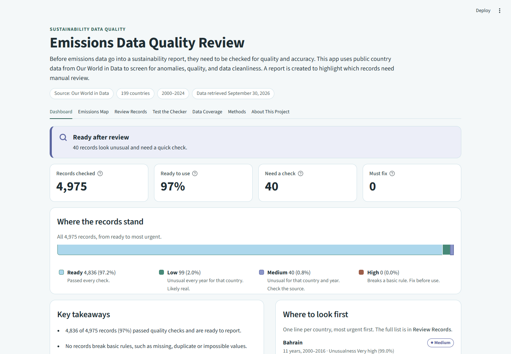
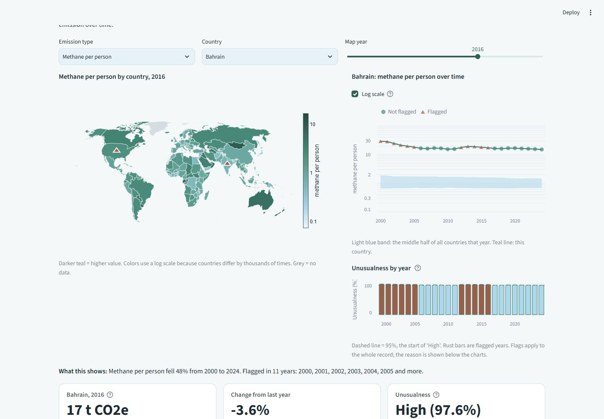
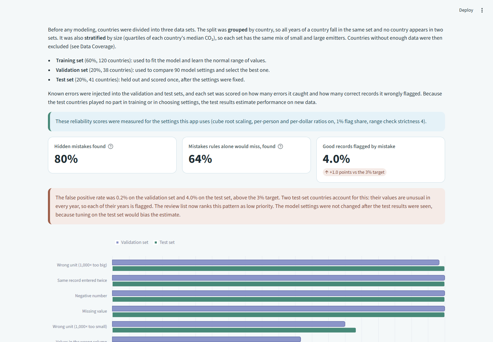

# Emissions Data Quality Review
Link: https://emissions-data-quality-review.streamlit.app/
An automated quality review for emissions data. Before emissions numbers go into a sustainability report, they need to be checked for quality and accuracy. This app checks every record in public country data from [Our World in Data](https://ourworldindata.org/co2-and-greenhouse-gas-emissions), flags what looks wrong, explains why, and produces a ranked list of records for manual review.



## Results at a glance

| | |
|---|---|
| Records checked | 4,975 country-years (199 countries, 2000–2024) |
| Ready to use | 97% passed every check |
| Need a manual check | 40 records (plus 99 low-priority records from 4 countries that are unusual every year) |
| Hidden mistakes found on unseen countries | **80%** of all planted mistakes; 64% of those that basic rules cannot catch |
| Good records flagged by mistake | 4.0% on the test set (0.2% on the validation set) |

## How it works

1. **Collect:** download the data and save a dated copy with a SHA-256 checksum, so every result can be reproduced.
2. **Investigate:** study missing data (by year and country) and outliers *before* deciding how to treat them. Gaps were structural (reporting lag, territories never covered), so they are reported rather than filled with invented values.
3. **Split:** divide countries into training, validation and test sets (60/20/20), grouped by country and stratified by emissions size, before any modeling decision.
4. **Check** every record three ways:
   - **Rule check** (pandera): missing, duplicate, negative or impossible values, each with a plain-English reason.
   - **Range check** (robust z-score): values far outside anything seen in training countries, which catches unit mistakes.
   - **Pattern check** (Isolation Forest, explained with SHAP): combinations of values that do not fit together.
5. **Test the checker:** inject 7 types of realistic mistakes (wrong units, misplaced decimals, swapped columns, duplicates and more) into held-out countries and measure how many are found. 90 setting combinations were compared on the validation set; the chosen settings were scored once on the test set.
6. **Report:** a readiness verdict, a prioritized review list (High / Medium / Low) and a per-record explanation.

### Quality improvement

The first version found only 38% of the mistakes that basic rules did not. Further testing revealed the pattern check cannot recognize values outside the range it was trained on, so a number 1,000 times too large looked like the largest real country. Adding a range check raised this to 64% while keeping false alarms within the 3% target on the validation set.

| Emissions map and trend | Measured reliability |
|---|---|
|  |  |

## App tabs

- **Dashboard:** readiness verdict, key numbers, takeaways and prioritized short list for manual review
- **Emissions Map:** map and year-by-year trend for any country and emission type.
- **Review Records:** the prioritized work queue, downloadable as CSV, with a closer look at each record.
- **Test the Checker:** out-of-sample evaluation and the before/after improvement.
- **Data Coverage:** data that could not be checked and why.
- **Methods:** study design, setting comparison, and the full technical audit trail.

## Run it

Requires Python 3.14 (tested with the exact versions in `requirements.txt`).

```bash
python -m venv .venv
.venv\Scripts\python -m pip install -r requirements-dev.txt     # macOS/Linux: .venv/bin/python
.venv\Scripts\python -m streamlit run app.py
```

The processed data and reports are included, so the app runs immediately. To rebuild everything from the source:

```bash
python data_prep.py      # downloads the latest OWID data, saves a checksummed snapshot, cleans and selects features
python evaluation.py     # compares settings on the validation set and scores the test set once
python -m pytest         # 220 tests
```

`python data_prep.py data/raw/<snapshot>.csv` reruns on a saved snapshot and refuses it if the checksum does not match. Raw snapshots are not committed (13 MB); their manifests (source, date, checksum) are. OWID updates its data, so a fresh download may give slightly different numbers.

## Project structure

| File | Purpose |
|---|---|
| `data_prep.py` | Download, snapshot, missing-data and outlier investigation, two-pass cleaning, transform and SHAP feature selection |
| `splitting.py` | Grouped, stratified train / validation / test split |
| `validation.py` | Rule, range and pattern checks; unusualness score |
| `evaluation.py` | Planted-error evaluation harness and settings selection |
| `review.py` | Plain-language review queue, verdict and insights |
| `transforms.py`, `outliers.py`, `mapview.py` | Supporting analysis |
| `design.py` | Color tokens with WCAG contrast and color-blindness checks |
| `app.py` | Streamlit app |
| `tests/` | Test suite (written test-first) |

## Accessibility

The color theme (teal, periwinkle, sky, rust) is checked automatically: text meets WCAG AA contrast, and every pair of data colors is checked under simulated color blindness (Machado et al., 2009).

## Limitations

- Unusual is not the same as wrong. Some countries (very large economies, small islands) are unusual every year; the review list ranks them as low priority.
- 19 countries, mostly small islands and territories, could not be checked because a key measure was never reported.
- Misplaced-decimal mistakes (10×) are the hardest to catch: 27% found on the test set.
- This checker does not indicate which data are lower quality. It serves to streamline the manual review process and prioritize for human review.

## Data source

Ritchie, H., Rosado, P., & Roser, M. (2023). *CO₂ and greenhouse gas emissions*. Our World in Data. https://ourworldindata.org/co2-and-greenhouse-gas-emissions

Rosado, P., Ritchie, H., Roser, M., Mathieu, E., & Macdonald, B. (n.d.). *Data on CO₂ and greenhouse gas emissions by Our World in Data* [Data set]. GitHub. Retrieved September 30, 2026, from https://github.com/owid/co2-data

Our World in Data publishes this data under the Creative Commons BY license.

## License

The code is released under the [MIT License](LICENSE). The emissions data comes from Our World in Data and remains under its own Creative Commons BY license.
